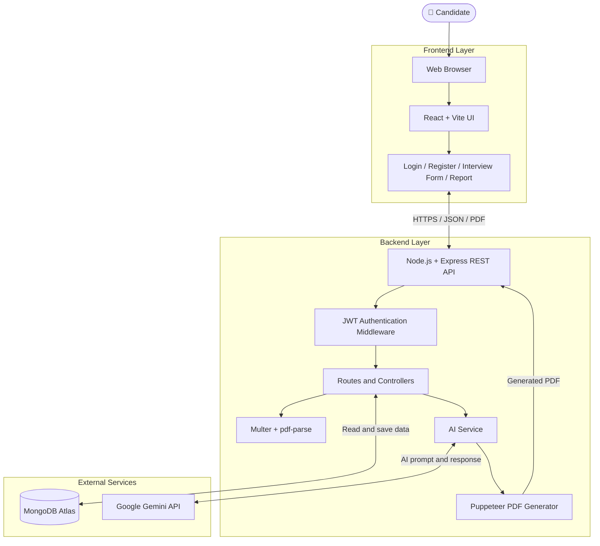
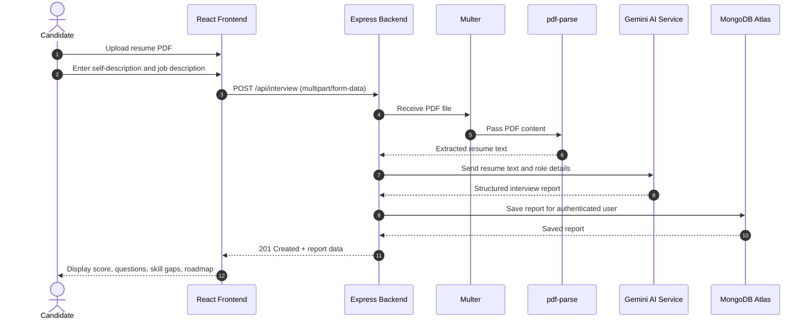
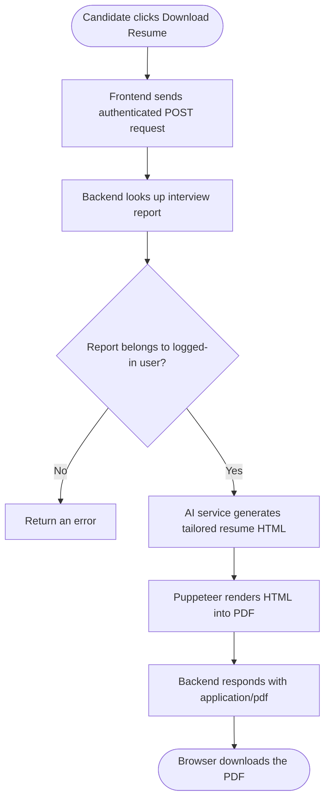
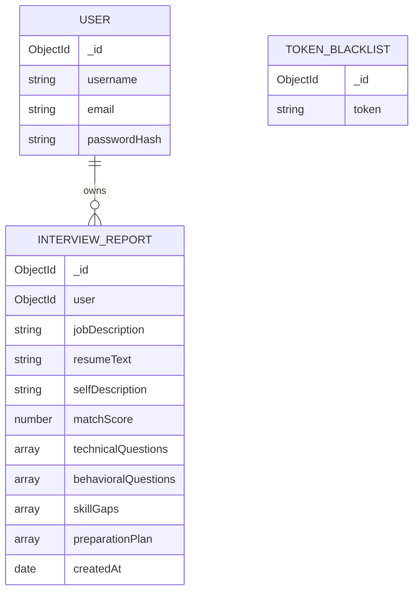
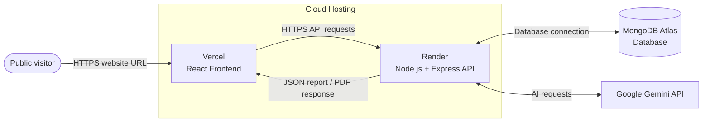

# 🤖 AI Interview Preparation Platform

An AI-powered full-stack web application that helps candidates prepare for interviews by analyzing a resume against a job description and generating a personalized preparation report using Google Gemini AI.

> **Note:** The diagrams in this README use Mermaid. GitHub renders these diagrams visually when this file is named `README.md` and viewed in the repository.

## 📌 Contents

- [Project Overview](#-project-overview)
- [Features](#-features)
- [Technology Stack](#-technology-stack)
- [System Architecture Diagram](#-system-architecture-diagram)
- [Interview Report Workflow](#-interview-report-workflow)
- [Resume PDF Workflow](#-resume-pdf-workflow)
- [Database Relationship Diagram](#-database-relationship-diagram)
- [Project Structure](#-project-structure)
- [Installation and Setup](#-installation-and-setup)
- [Environment Variables](#-environment-variables)
- [API Endpoints](#-api-endpoints)
- [Deployment Diagram](#-deployment-diagram)
- [Troubleshooting and Security](#-troubleshooting-and-security)

## 🎯 Project Overview

The platform lets a candidate register or log in, upload a resume PDF, provide a self-description and target job description, and generate an AI-based interview preparation report. Reports can be saved and retrieved, and the application can generate a tailored resume PDF.

## ✨ Features

- User registration and login using JWT-based cookie authentication.
- Resume PDF upload and text extraction.
- Resume and job-description matching.
- Interview match score.
- Technical and behavioral interview questions.
- Skill-gap analysis and preparation roadmap.
- Store and retrieve a user's interview reports.
- Generate a tailored resume PDF using Puppeteer.

AI-generated output is a preparation aid, not a guarantee of interview success. Review the generated content before using it.

## 🧰 Technology Stack

| Layer | Technology | Purpose |
|---|---|---|
| Frontend | React, Vite, JavaScript | User interface |
| Routing | React Router | Page navigation |
| HTTP requests | Axios | Frontend-to-backend requests |
| Styling | SCSS | UI styling |
| Shared state | React Context API | Shared authentication/application state |
| Backend | Node.js, Express | REST API and business logic |
| Database | MongoDB Atlas, Mongoose | Store users and reports |
| Authentication | JWT, bcryptjs, cookies | Secure login/session handling |
| AI | Google Gemini API | Generate report and resume content |
| PDF parsing | `pdf-parse` | Extract text from uploaded PDF |
| Upload handling | Multer | Receive uploaded PDF |
| PDF creation | Puppeteer | Render HTML as PDF |
| Validation | Zod | Validate/structure data |

## 🏛️ System Architecture Diagram



### What each layer does

1. **Frontend:** Displays forms and reports, collects user input, and sends requests.
2. **Backend:** Authenticates users and runs report-generation and PDF-generation logic.
3. **MongoDB Atlas:** Stores user accounts and interview reports.
4. **Gemini API:** Produces personalized interview preparation content.
5. **PDF tools:** `pdf-parse` extracts text from a resume; Puppeteer converts generated HTML into a PDF.

## 🔄 Interview Report Workflow



### Report generation input fields

| Field | Type | Description |
|---|---|---|
| `resume` | File (PDF) | Candidate's resume |
| `selfDescription` | Text | Candidate's summary or experience |
| `jobDescription` | Text | Target job description |

Send these fields as `multipart/form-data` to `POST /api/interview/`.

## 📄 Resume PDF Workflow



The PDF endpoint is a **POST** route:

`POST /api/interview/resume/pdf/:interviewReportId`

## 🗃️ Database Relationship Diagram

The following is a conceptual diagram. The actual Mongoose model files define the exact field names and types.



- **User:** Account details and hashed password.
- **Interview report:** Resume/job information and AI-generated preparation results.
- **Token blacklist:** Invalidated tokens, if used by the logout implementation.

## 📁 Project Structure

```text
AI-Interview-Preparation/
├── Backend/
│   ├── server.js
│   ├── package.json
│   ├── .env                       # Local secrets; never commit
│   └── src/
│       ├── app.js
│       ├── config/
│       │   └── database.js
│       ├── controllers/
│       │   ├── auth.controller.js
│       │   └── interview.controller.js
│       ├── middlewares/
│       │   ├── auth.middleware.js
│       │   └── file.middleware.js
│       ├── models/
│       │   ├── user.model.js
│       │   ├── interviewReport.model.js
│       │   └── blacklist.model.js
│       ├── routes/
│       │   ├── auth.routes.js
│       │   └── interview.routes.js
│       └── services/
│           └── ai.service.js
├── Frontend/
│   ├── public/
│   ├── src/
│   │   ├── App.jsx
│   │   ├── app.routes.jsx
│   │   └── features/
│   │       ├── auth/
│   │       └── interview/
│   ├── index.html
│   ├── vite.config.js
│   └── package.json
├── .gitignore
└── README.md
```

This is a high-level structure; check the repository for the exact files present in your current version.

## 🚀 Installation and Setup

### Prerequisites

- Node.js and npm
- MongoDB Atlas cluster (or a local MongoDB instance)
- Google Gemini API key
- VS Code (recommended)

### 1. Get the repository

If the project is already on your computer, open the existing project folder and skip the clone command.

```bash
git clone https://github.com/8630324571/AI-Interview-Preparation.git
cd AI-Interview-Preparation
```

### 2. Install and start the backend

```bash
cd Backend
npm install
```

Create `Backend/.env` as shown in the next section. Start the backend using the script configured in `Backend/package.json` (for example, `npm run dev`).

Local backend address tested during development: `http://localhost:3000`.

### 3. Install and start the frontend

Open a **second terminal** from the project root:

```bash
cd Frontend
npm install
npm run dev
```

Open `http://localhost:5173` in the browser.

### 4. Test the main flow

1. Register a user.
2. Log in.
3. Upload a resume PDF.
4. Enter a self-description and job description.
5. Generate and review the report.
6. Download a resume PDF.

## 🔐 Environment Variables

Create `Backend/.env`:

```env
MONGO_URI=mongodb+srv://<database-user>:<encoded-password>@<cluster-host>/<database-name>
JWT_SECRET=<long-random-secret>
GOOGLE_GENAI_API_KEY=<your-gemini-api-key>
```

| Variable | Purpose |
|---|---|
| `MONGO_URI` | MongoDB connection string |
| `JWT_SECRET` | JWT signing/verification secret |
| `GOOGLE_GENAI_API_KEY` | Google Gemini API key |

**Never commit `.env` or publish real credentials.** URL-encode special characters in MongoDB passwords. If a key or password was exposed, rotate it before deployment. Add these variables through the hosting provider's secure environment settings.

## 🔌 API Endpoints

Protected endpoints require valid authentication.

### Authentication — `/api/auth`

| Method | Endpoint | Purpose |
|---|---|---|
| `POST` | `/api/auth/register` | Create an account |
| `POST` | `/api/auth/login` | Log in and set the authentication cookie |
| `GET` | `/api/auth/logout` | Log out / clear or invalidate token |
| `GET` | `/api/auth/get-me` | Get current user's details |

Example login body:

```json
{
  "email": "user@example.com",
  "password": "your-password"
}
```

Registration may also require a username, depending on the current backend validation.

### Interview — `/api/interview`

| Method | Endpoint | Access | Purpose |
|---|---|---|---|
| `POST` | `/api/interview/` | Protected | Upload resume and generate report |
| `GET` | `/api/interview/` | Protected | List current user's reports |
| `GET` | `/api/interview/report/:interviewId` | Protected | Retrieve one report |
| `POST` | `/api/interview/resume/pdf/:interviewReportId` | Protected | Generate/download resume PDF |

Check the backend route and controller files for exact response fields and validation behavior.

## ☁️ Deployment Diagram



### Deployment checklist

1. Confirm the backend listens on the hosting platform's `PORT` environment variable.
2. Use the correct start command from `Backend/package.json`.
3. Add `MONGO_URI`, `JWT_SECRET`, and `GOOGLE_GENAI_API_KEY` to Render's environment settings.
4. Configure the frontend's production API URL to point to the deployed backend; remove hard-coded `localhost` URLs.
5. Configure CORS and cookie settings for the deployed frontend domain. Cross-site cookies may require `Secure` and a suitable `SameSite` setting.
6. Configure MongoDB Atlas Network Access so the deployed backend can connect.
7. Test registration, login, report generation, report history, and PDF download on the live site.

Free hosting tiers may have usage limits, cold starts, or services that sleep after inactivity. Review current provider terms before production use.

## 🧯 Troubleshooting and Security

### Frontend opens but API calls fail
- Confirm the backend is running.
- Check the frontend API base URL.
- Inspect browser DevTools → Network and Console.
- Replace production `localhost` URLs with the deployed backend URL.

### Login works in Postman but not in the browser
- Check CORS and credential settings.
- Ensure the frontend sends cookies when required.
- Verify cookie `SameSite` and `Secure` settings when the frontend and backend use different domains.

### MongoDB connection fails
- Check `MONGO_URI`, database-user permissions, and Atlas Network Access.
- Never share the full connection string publicly.

### Gemini requests fail
- Verify `GOOGLE_GENAI_API_KEY`, quotas, API availability, and account settings.
- Review logs without printing secrets.

### PDF generation fails
- Confirm the report exists and belongs to the authenticated user.
- Confirm the request uses `POST`.
- Check Puppeteer/browser dependencies in the hosting logs.

### Security checklist
- Keep `.env` and credentials out of Git.
- Use a strong database password and a least-privilege database user.
- Restrict Atlas network access where possible.
- Use HTTPS for public deployments.
- Keep file type and size validation enabled.
- Add rate limiting, monitoring, and privacy disclosures before broad public use.
- Review AI-generated content before using it professionally.

---

**Built to help candidates prepare smarter for their next interview.**
